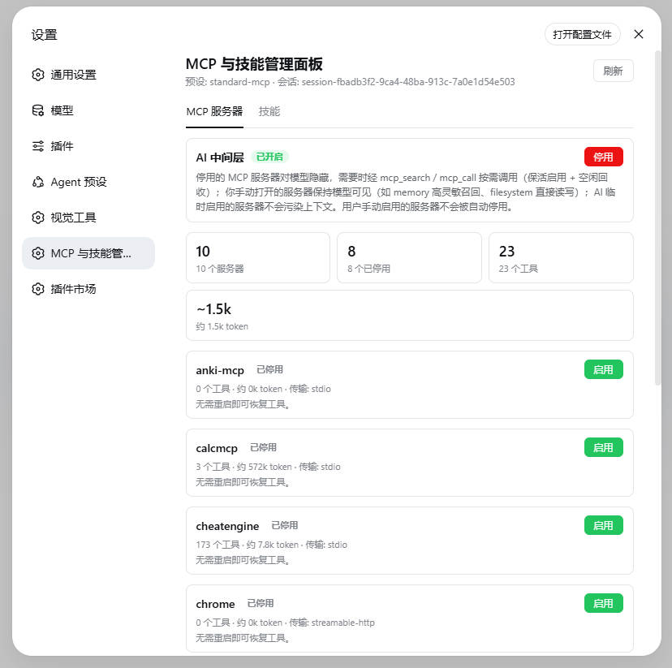
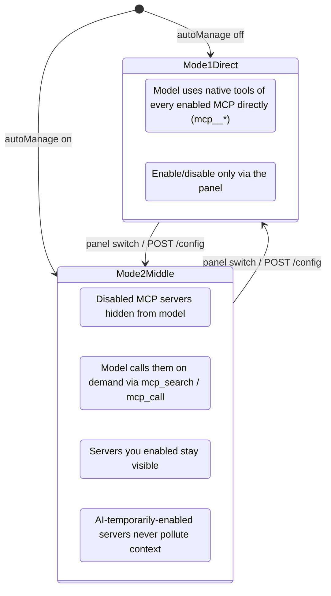
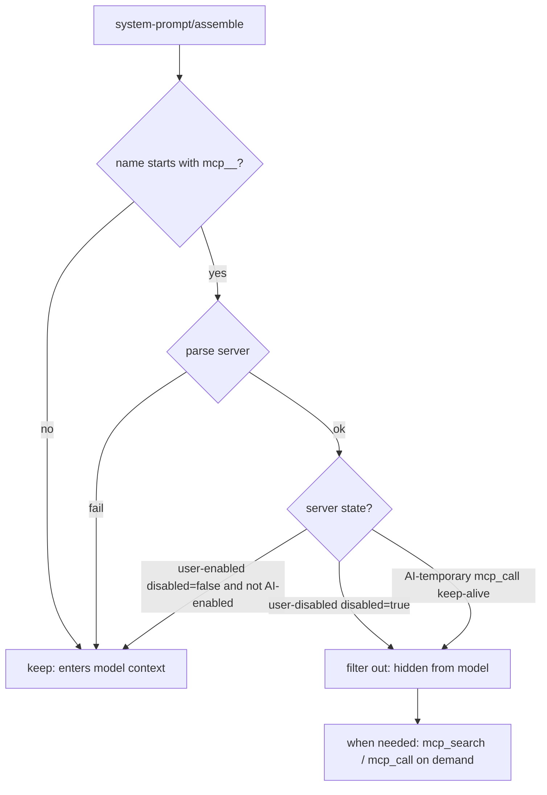
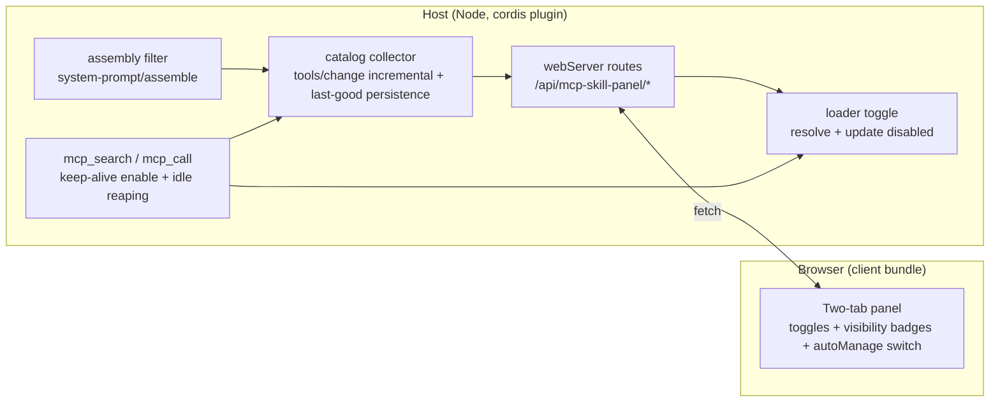

<p align="center">
  <strong style="font-size: 2.2em">🧩 MCP & Skill Manager</strong><br>
  <span style="font-size: 1.1em">DeepSeek Harness (DSH) Web plugin · Real-time enable/disable for MCP servers & Skill catalog · Optional AI middle layer (on-demand calls)</span>
</p>

<p align="center">
  <strong>English</strong> · <a href="./README.md">🌐 中文</a>
</p>

<p align="center">
  
  
</p>

---

## ✨ What it is

A settings-page panel that turns your **MCP servers** and **Skill catalog** into an actionable list: one toggle per entry — **disabling releases context usage instantly, enabling works without a restart**. It also ships an optional **AI middle layer** (`autoManage`): disabled MCP servers stay hidden from the model and are called on demand, while servers *you* enabled stay visible — your toggles decide exactly what the model context pays for.



## 🎯 Core features

| Feature | Description |
| --- | --- |
| 🟢 **Real-time MCP toggle** | Disable → loader entry is disposed (connection closed + all `mcp__<server>__*` tools unregistered), tools disappear from the model catalog immediately and their schema tokens are freed; enable → reconnect + tools restored, **no restart** |
| 🧠 **Skill toggle** | Injects/removes `disable-model-invocation: true` in SKILL.md frontmatter; the model catalog updates in real time |
| 📊 **Backfill while disabled** | Disabled MCP cards still show "N tools / ~N tokens in catalog" (last-good snapshot from the private catalog), so you can decide whether re-enabling is worth the context cost |
| 🤖 **AI middle layer (optional switch)** | With `autoManage` on: **disabled MCP servers are hidden from the model** and used on demand via `mcp_search` (top-K catalog search with exact schemas) and `mcp_call` (keep-alive enable → in-plugin execute → idle 30s auto reaping); **servers you enabled stay visible** (e.g. memory for high-sensitivity recall, filesystem for direct IO); AI-temporarily-enabled servers never pollute context |
| 🔒 **Your toggles are never overridden by the model** | The reaper only reclaims servers that *AI* enabled from a disabled state; servers you manually enabled are never auto-disabled (toggle clears AI marks) |
| 💾 **Survives restarts** | MCP state is materialized into the preset composition file via the plugin state file (`~/.dsh/dsh-mcp-skill-panel/state.json`); catalog snapshots persist (`catalog.json`) and backfill after restart |
| ⚡ **Fast** | Toggles flip instantly (optimistic UI + server confirmation); domain caches with event-driven invalidation (`tools/change` / `skills/change`); the MCP tab never triggers skill discovery |
| 🌐 **Bilingual UI** | All copy zh/en, follows the DSH UI language; light/dark theme aware |
| 🪶 **Zero context footprint** | The plugin itself registers no model tools and consumes no injection surface (with the switch off it behaves like it isn't installed) |

## 🏗️ Two modes (the "AI Middle Layer" switch in the panel)



Assembly filtering in mode 2 (evaluated every turn):



## 📦 Install

```sh
dsh plugin --profile web add "github:lilyblessing/dsh-mcp-skill-panel#main"
```

Prebuilt artifacts are committed (`lib/`), so the git-source one-liner installs without a build step. **Restart `dsh web`** after installing (bundles are composed at startup; hot reload does not apply), then open Settings → **MCP & Skill Manager**.

## 🚀 Usage

1. Settings → **MCP & Skill Manager**
2. **MCP Servers** tab: each card shows server name, status badge (Active / Disabled / No tools / Failed), a **model-visibility badge** (in middle-layer mode: user-enabled = visible, disabled / AI-temporary = hidden), tool count and estimated token usage; toggle with the button on the right
3. **Skills** tab: each card shows name, source, description, model-visibility badge; toggle on the right
4. **AI Middle Layer switch**: on → disabled MCP servers are used on demand by the model (see modes above); off → classic direct mode
5. **Manual management** (optional): edit the preset composition file (`disabled: true` rows) or SKILL.md frontmatter (`disable-model-invocation: true`) directly — takes effect on next restart/change

> Badge meanings: 🟢 Active (has tools) / ⚪ Disabled / 🟡 No tools (process running but empty tool list — usually a failed server start or empty implementation) / 🔴 Failed (neither running nor disabled).

## 🔌 HTTP API

| Method | Path | Description |
| --- | --- | --- |
| GET | `/api/mcp-skill-panel/state?session=<id>&part=<mcp\|skills\|all>` | Catalog snapshot; `part` scopes the fetch (the UI lazy-loads per tab), defaults to `all`; without session, the first root agent is used |
| POST | `/api/mcp-skill-panel/mcp/toggle` | `{ entryId, disabled }` |
| POST | `/api/mcp-skill-panel/skill/toggle` | `{ name, disabled }` |
| GET | `/api/mcp-skill-panel/config` | Read the AI middle layer switch state |
| POST | `/api/mcp-skill-panel/config` | `{ autoManage: boolean }` toggle the AI middle layer (persisted to state.json) |
| GET | `/api/mcp-skill-panel/debug` | Catalog collection diagnostics (event counters / snapshot telemetry / in-memory catalog summary) |
| POST | `/api/mcp-skill-panel/debug/collect` | Trigger one catalog snapshot manually |
| GET | `/api/mcp-skill-panel/token` | Per-process random token (the panel fetches it and attaches `x-panel-token` on every POST) |

> **Write auth (0.4.7+)**: every POST (mcp/skill toggle, config, debug/collect) requires an `x-panel-token` header equal to the per-process random token, else 401 — this blocks cross-origin / DNS-rebinding blind writes to the local control endpoints; read-only GET endpoints (state/config/debug/token) stay open.
> The legacy prefix `/api/runtime-inventory/*` (≤0.3.1) is still registered for compatibility. Domain caches (60s TTL fallback) are invalidated precisely by events: `tools/change` / `loader/partial-dispose` → MCP domain; `skills/change` → Skill domain.

## ⚙️ How it works



**MCP toggling**: each MCP row is a loader entry in the agent preset composition (`agent.cordis.yml`, `@deepseek-ai/dsh-mcp-client`, full id like `include:agent-presets:mcp-cheatengine`). `loader.resolve(id).update({ disabled })` disposes/restarts the entry in real time.

**Why persistence takes two steps**: the preset tree's `write()` is an explicit no-op, and `dsh-agent-presets` detects preset-file changes via a `{mtimeMs, size}` stamp — writing that file at runtime triggers a standing remount without disposing old instances (serverName conflicts, session creation failures — a 0.1.0 incident). So toggles only write the plugin state file, and the intent is materialized into the preset file during `apply` (early startup, before the standing mount).

**Middle-layer call chain** (`mcp_call` against a disabled server):

```mermaid
sequenceDiagram
    participant M as Model
    participant P as Plugin (mcp_call)
    participant L as loader
    participant S as MCP server

    M->>P: mcp_call(server, tool, args)
    P->>L: entry.update({disabled:false}) (record AI owner)
    L->>S: spawn / reconnect
    P->>P: wait for registration (poll tools.get + tools/change)
    P->>S: tools.execute (in-plugin execution)
    S-->>P: result
    P-->>M: text result
    Note over P: refcount -1; idle 30s then reap (AI-enabled only)
```

**Catalog collection**: `tools/change` (root listener, 150ms debounce) incrementally snapshots enabled servers; when `agents` is unavailable in the apply context it falls back to `agentPresets.standingKeyFor()` to resolve the scope (v0.4.1 fix); empty snapshots never overwrite the on-disk last-good; `catalog.json` is written atomically (tmp + rename, 0600).

## ✅ Verification checklist

| Check | Action | Expected |
| --- | --- | --- |
| Panel entry | Restart, open Settings | "MCP & Skill Manager" appears with two tabs; zh/en follows UI language |
| Disable MCP | Turn a server off | Card shows "Disabled"; new turns no longer include `mcp__<server>__*`; the card still shows catalog tool count |
| Enable MCP | Turn it back on | Tools restored, **no restart** |
| Persistence | Disable, restart dsh | Server stays disabled |
| Skill toggle | Flip a skill | Card flips instantly without bouncing; model catalog updated |
| External change | Session A disables an MCP, session B opens the panel | Fresh state without manual refresh |
| AI middle layer | Turn autoManage on in the panel | Disabled servers hidden from the model, `mcp_search`/`mcp_call` available; user-enabled servers show the "visible" badge |
| Reaper safety | Let a model-called server idle 30s | AI-temporarily-enabled server auto-disables; user-enabled servers are never reclaimed |

## ⚠️ Known limitations

- Toggles act at the preset layer: one server/skill switch affects all sessions under that preset.
- SKILL.md files without frontmatter cannot be toggled (the provider ignores them anyway).
- Tool counts/tokens are estimates (`JSON.stringify(parameters).length / 4`), approximate to the real injection surface.
- After disabling, tools disappear immediately, but the current turn's cached request (if any) may still reference old schemas; the next request refreshes naturally.
- **Persistence lag**: toggles take effect live; surviving a restart depends on materialization at next startup — if the plugin is hot-updated while sessions are running, this process does not materialize; the next restart applies it.
- **Manually editing MCP rows in the preset file** (e.g. removing `disabled: true` by hand) removes that row from the plugin's management (your edit is respected at next startup).
- Writing SKILL.md at runtime is safe (the skill-filesystem watcher expects edits); writing the preset composition file at runtime triggers the stamp-remount incident, which the plugin deliberately never does.
- The capability summary (`mcp_search` with no args) only covers servers that have a catalog snapshot or a configured `serverSummary`; servers that never started successfully (e.g. codegraph) are not listed.
- **Control-endpoint auth**: writes are gated by a per-process random token (`x-panel-token`), auto-attached by the same-origin panel; GET reads stay open. The host webServer has no auth layer of its own — if you expose the listener on `0.0.0.0`, rely on external network isolation.

## 🛠️ Development

Dependencies are now **self-contained** (`@deepseek-ai/*` build-time deps are all in devDependencies; a plain registry install works — **no local DSH closure needed**):

```sh
npm install --legacy-peer-deps --ignore-scripts   # one-time (npm run setup / junctions no longer required)
npm run typecheck  # tsc type check (Context service augmentation comes from @deepseek-ai devDeps)
npm run build      # tsdown (node external all @deepseek-ai/*) -> tsc dts last (order matters)
npm run verify     # artifact verification (no inlined TOOL_RUNTIME_SCHEDULER, client wrapper, lib/types)
node scripts/selftest-mcp.mjs  # catalog unit tests
```

> **lib/ artifacts are rebuilt by GitHub Actions** (`.github/workflows/build.yml`): push your source, CI runs typecheck → build → verify → selftest and, on `main`, commits the fresh `lib/` back with `[skip ci]` — remember to `git pull` to collect it.
> Why `--legacy-peer-deps`: runtime peers come from the DSH closure, while rc.6/rc.7 registry peer graphs conflict (ERESOLVE); why `--ignore-scripts`: esbuild ships platform binaries via optionalDependencies, no postinstall needed.

The node-half tsdown build must use `external: [/^@deepseek-ai\//]`: inlining dsh-tools creates a second `TOOL_RUNTIME_SCHEDULER` Symbol and breaks tool dispatch (same lesson as dsh-context-doctor).

## 📋 Changelog

| Version | Content |
| --- | --- |
| 0.4.8 | Self-contained build + CI: 14 `@deepseek-ai/*` added to devDependencies (pinned to the rc.6 line; plain registry install enables typecheck/build/selftest without the local DSH closure); new GitHub Actions pipeline (typecheck → build → verify → selftest; on main push it rebuilds and commits `lib/` back with `[skip ci]`) |
| 0.4.7 | Security & robustness: the toggle endpoint now validates the target row is an MCP row (blocks disabling arbitrary loader rows); all write endpoints are gated by a per-process token (`x-panel-token`, blocks cross-origin/DNS-rebinding blind writes); 64KB request-body cap; `waitRegistered` bound to context disposal/AbortSignal (no hung mcp_call on unload); removed hardcoded DEFAULT_SUMMARY (capability summary lists real servers only); client unified on the new API prefix and auto-attaches the token; build order fixed so lib/types artifacts ship (types declaration no longer dangles); empty package-lock.json fixed |
| 0.4.3 | Performance pass: restore race fixed (a user manually enabling a server mid-call is never disabled on failure); per-turn visibility Map cache in the assembly filter (O(1) lookups); 500ms schemas reuse window; 300ms catalog persist debounce; in-memory state.json with write merging; 80-char summary truncation; disabled-state token estimate cache; proactive TTL pruning of cache maps; snapshotServer dead code removed |
| 0.4.2 | Assembly filter keyed by server state: MCP tools of user-enabled servers enter the model context (memory high-sensitivity recall); disabled ones are hidden and called on demand via mcp_search/mcp_call; AI-temporary enables never pollute context; manual enable clears AI marks (reaper safety); panel autoManage switch + model-visibility badges |
| 0.4.1 | Catalog collection pipeline fixes: empty `agents` in apply ctx made auto collection always empty (fallback to `standingKeyFor` for scope), last-good guard failure, empty-snapshot disk overwrite at startup, persist race; debug diagnostic endpoints; case retests passed (chrome→mimo cross-server, calcmcp burst zero-respawn + 30s reaping) |
| 0.4.0 | AI middle layer (`autoManage`): `mcp_search`/`mcp_call` on-demand MCP usage (keep-alive + idle reaping + assembly filter); private catalog persistence + disabled-state backfill |
| 0.3.2 | API prefix aligned with package name (legacy prefix kept); local dir renamed |
| 0.3.1 | Versioned MCP aggregate reuse; frontend fetch out-of-order guard |
| 0.3.0 | Scoped endpoints + domain caches + event-driven invalidation (tab lazy loading) |
| 0.2.1 | Skill toggle 30s UI lag root cause fixed (confirmed values override stale catalog) |
| 0.2.0 | Renamed to "MCP & Skill Manager" + GitHub repo `dsh-mcp-skill-panel` |
| 0.1.1 | MCP persistence rework (state file + early-startup materialization), fixing session creation failures caused by writing the preset file at runtime |
| 0.1.0 | Initial: MCP/Skill listing + toggles |

## 📄 License

[MIT](./LICENSE) © lilyblessing
