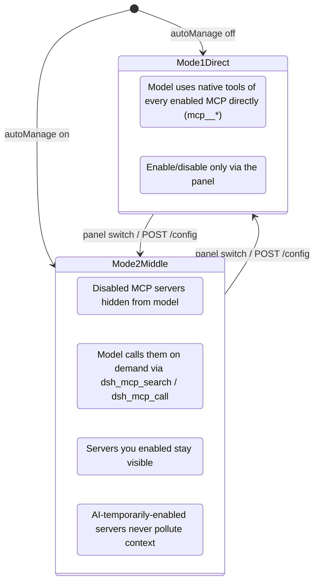
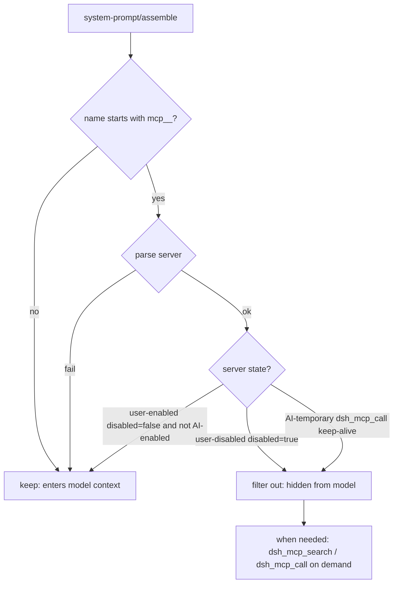
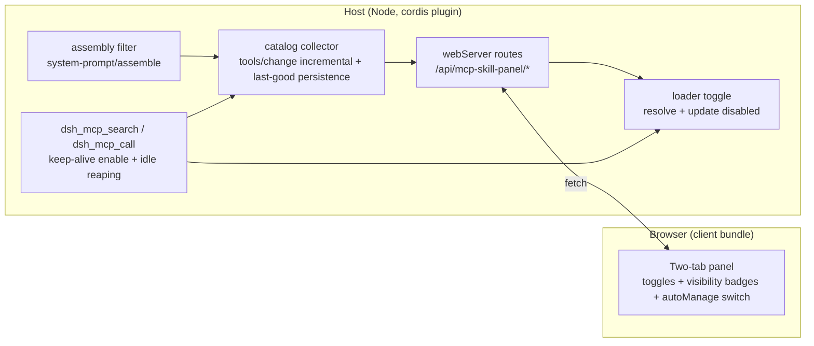

<p align="center">
  <strong style="font-size: 2.2em">🧩 MCP & Skill Manager</strong><br>
  <span style="font-size: 1.1em">DeepSeek Harness (DSH) Web plugin · Real-time enable/disable for MCP servers & Skill catalog · Optional AI middle layer (on-demand calls)</span>
</p>

<p align="center">
  <strong>English</strong> · <a href="./README.md">🌐 中文</a>
</p>

<p align="center">
  
  
</p>

---

## ✨ What it is

A settings-page panel that turns your **MCP servers** and **Skill catalog** into an actionable list: one toggle per entry — **disabling releases context usage instantly, enabling works without a restart**. It also ships an optional **AI middle layer** (`autoManage`): disabled MCP servers stay hidden from the model and are called on demand, while servers *you* enabled stay visible — your toggles decide exactly what the model context pays for.


## 🎯 Core features

| Feature | Description |
| --- | --- |
| 🟢 **Real-time MCP toggle** | Disable → loader entry is disposed (connection closed + all `mcp__<server>__*` tools unregistered), tools disappear from the model catalog immediately and their schema tokens are freed; enable → reconnect + tools restored, **no restart** |
| 🧠 **Skill toggle** | Injects/removes `disable-model-invocation: true` in SKILL.md frontmatter; the model catalog updates in real time |
| 📊 **Backfill while disabled** | Disabled MCP cards still show "N tools / ~N tokens in catalog" (last-good snapshot from the private catalog), so you can decide whether re-enabling is worth the context cost |
| 🤖 **AI middle layer (optional switch)** | With `autoManage` on: **disabled MCP servers are hidden from the model** and used on demand via `dsh_mcp_search` (top-K catalog search with exact schemas) and `dsh_mcp_call` (keep-alive enable → in-plugin execute → idle 30s auto reaping); **servers you enabled stay visible** (e.g. memory for high-sensitivity recall, filesystem for direct IO); AI-temporarily-enabled servers never pollute context |
| 🔒 **Your toggles are never overridden by the model** | The reaper only reclaims servers that *AI* enabled from a disabled state; servers you manually enabled are never auto-disabled (toggle clears AI marks) |
| 💾 **Survives restarts** | MCP state is materialized into the preset composition file via the plugin state file (`~/.dsh/dsh-mcp-skill-panel/state.json`); catalog snapshots persist (`catalog.json`) and backfill after restart |
| ⚡ **Fast** | Toggles flip instantly (optimistic UI + server confirmation); domain caches with event-driven invalidation (`tools/change` / `skills/change`); the MCP tab never triggers skill discovery |
| ⏱️ **Apply-timing options** | Manual toggles can take effect **immediately** or **at next session** — the latter costs zero cache invalidation and zero extra fees; the AI middle layer's on-demand calls never trigger a cache miss either |
| ➕ **Quick migration add** | Paste another harness's `mcpServers` JSON (Claude Code / Codex etc.) in the panel → conversion preview → add as global (written into the profile patch) or project (`.dsh/mcps/mcp.json`) in one click; `type`/`transport` are inferred automatically and `${VAR}` environment variables are interpolated |
| 📁 **Project-level MCP** | Reads `<workspace>/.dsh/mcps/**/mcp.json` (root directory first, subdirectories override by serverName), visible **only to sessions of that workspace** (filtered by session cwd); file changes hot-reload |
| 🛠️ **Tool-level disable** | Per-tool control on top of server-level toggles: disabled tools are filtered from `dsh_mcp_search` results and rejected outright by `dsh_mcp_call`; project MCP is scoped per workspace (disabling a tool in workspace A does not affect workspace B) |
| 🧮 **Tool-level bulk toggle** | `POST /mcp/toolBulk` writes a whole batch in one read-modify-write (never N writes): `toolNames` is **three-state** — omitted = every tool in that server's current catalog / array = exact set (`[]` is a legal no-op) / non-array, or non-empty but matching nothing = 400 (never silently degrades to "all", never silently no-ops). The response carries `ignoredToolNames` for names that no longer exist in the catalog view |
| 📈 **Effective stats** | Tool and token counts are shown twice: catalog total and **tool-level enabled count** (recomputed with the same predicate as the assembly filter — `isToolDisabled` + session workspace), so disabling 400 tools no longer still shows 450. **Boundary**: only tool-level disables are subtracted; server-level hiding (AI-temporary / `middleLayerHides='all'`) and the project-mcp workspace filter are not |
| 🎯 **Tool budget** | `toolBudget` draws a red line (e.g. 350) on the **all-tools** count (including read/edit/bash/skill); the source is the request face first — `toolsAllSource='request'` (the assembled tool list of the session's last persisted request) — falling back to the registry figure `'registry'`, with the source **labeled on the card** (the registry figure is an approximation) |
| 🧭 **Per-model middle layer** | `autoManageByRoute` enables the middle layer per `provider` or `provider/model`; lookup order is `provider/model` → `provider` → the `autoManage` master switch. If any override is true the middle layer is mounted even with the master switch off (that model gets `dsh_mcp_search` / `dsh_mcp_call`), other models keep the direct form |
| 🙈 **`middleLayerHides`** | Hidden range for the middle layer, default `'disabled'` (hide disabled servers only); `'all'` hides **even enabled servers** from the model's assembly face so the model takes everything through the middle layer — it only changes this turn's visibility, never the tool registry or the `dsh_mcp_call` execution path |
| 🌐 **Bilingual UI** | All copy zh/en, follows the DSH UI language; light/dark theme aware |
| 🪶 **Zero context footprint** | The plugin itself registers no model tools and consumes no injection surface (with the switch off it behaves like it isn't installed) |
| 🪄 **Create skills** | Fill in name/description/instructions in the panel to create a skill (global `~/.dsh/skills` or project root `.dsh/skills`); upload a SKILL.md to autofill from its frontmatter — the new skill is visible immediately |

## 🧾 Config items

Panel-writable config lives in `~/.dsh/dsh-mcp-skill-panel/state.json` (it takes precedence over the cordis `config` block) and is read/written via `GET/POST /config`:

| Config | Values | Description |
| --- | --- | --- |
| `autoManage` | `false` (default) / `true` | Master switch for the AI middle layer (mode 1 ↔ mode 2) |
| `applyMode` | `immediate` (default) / `next-session` | When manual toggles take effect (see below) |
| `toolBudget` | positive integer / empty | Tool-count red line over **all tools** (including read/edit/bash/skill); empty = no warning. The number is only a configurable default — see Known limitations |
| `autoManageByRoute` | `{ "<provider>": bool, "<provider>/<model>": bool }` | **Per-model** middle layer; lookup order `provider/model` → `provider` → `autoManage`. Edited one key at a time via `POST /config`'s `routeOverride: { key, value }` (`value: null` deletes the key); any true override mounts the middle layer |
| `middleLayerHides` | `'disabled'` (default) / `'all'` | Hidden range: `'disabled'` hides disabled servers only; `'all'` hides enabled servers too |

## 🏗️ Two modes (the "AI Middle Layer" switch in the panel)



Assembly filtering in mode 2 (evaluated every turn):



## ⏱️ Apply timing: immediate vs next session

The panel offers an "apply timing" option for manual toggles (a dropdown next to each switch), with two settings: **immediate** (default) and **next session**. The difference has a direct impact on Prompt Cache costs.

### The two modes for manual toggles

- **Immediate** (default): the switch lands on the **next conversation turn** — the tool prefix changes from that turn on, so the **prefix KV-cache is invalidated 100%** and that turn is billed at miss rates (roughly **5–12.5×** the hit rate). Choose this when you need to free or restore context right away.

- **Next session**: only the intent is recorded; the current session keeps its tool set all the way through → **zero cache invalidation, zero extra cost**. The change is only applied when one of these boundaries arrives:
  - before the first request of a new session (the `agent/session-start` phase);
  - on DSH restart (materialized into the preset composition file by `syncPresetFiles` early in startup).

  The panel also provides an **"Apply pending changes now"** button as an explicit, cost-aware escape hatch — clicking it applies immediately (equivalent to choosing "immediate" and applying).

### On-demand calls through the AI middle layer: naturally cache-safe

With the AI middle layer (`autoManage`) on, the model reaches disabled MCP servers via `dsh_mcp_search` / `dsh_mcp_call` — such temporary enables **never cause a cache miss**. Why: the per-turn assembly filter (`system-prompt/assemble` waterfall) keeps temporarily-enabled servers invisible to the model, so the prefix stays constant and the KV-cache keeps hitting.

### Defaults and boundaries

| Item | Value |
| --- | --- |
| Default | `immediate` (historical behavior) |
| Choosing `next-session` | must be selected explicitly in the panel |
| Applied at | first request of a new session + DSH restart |
| Current session | later turns of an open session are unaffected |

### One-line takeaway

> Want to save cost without urgently freeing context → use **next session**; need to free or restore tools in the current session right now → **immediate** (expect one cache miss on that turn).

## 📦 Install

```sh
dsh plugin --profile web add "github:lilyblessing/dsh-mcp-skill-panel#main"
```

Prebuilt artifacts are committed (`lib/`), so the git-source one-liner installs without a build step. **Restart `dsh web`** after installing (bundles are composed at startup; hot reload does not apply), then open Settings → **MCP & Skill Manager**.

> 🎯 Targets DSH `0.1.5-rc2`; on earlier DSH versions, upgrade DSH first, then install/update this plugin.
>
> 📦 Also published on **npm**: `dsh-mcp-skill-panel` ([npm page](https://www.npmjs.com/package/dsh-mcp-skill-panel)). The npm release ships prebuilt artifacts and can be installed by package name, skipping the `allowBuilds` approval; the git-source one-liner above always works.
>
> ⬆️ **Upgrade**: git-source users, run `pnpm update dsh-mcp-skill-panel` in the DSH profile directory (`pnpm add` does not re-resolve the same git spec); npm users can simply `pnpm add dsh-mcp-skill-panel@latest` (the actually published version is whatever `npm view dsh-mcp-skill-panel version` reports). npm releases **may lag behind the repository** (0.5.4 / 0.5.5 were published and later unpublished); the latest code is what the **repository** (git source) has.
>
> 🔁 **Restart DSH after updating the plugin** (same reason as installing: bundles are composed at startup). If you only run `pnpm update`, the browser has already loaded the new client while the host process still runs the old code (no `/models` route → 404), so the override card shows the "endpoint not registered (restart DSH after updating the plugin)" degraded notice. **That is expected** — restarting clears it; there is no network or panel-token issue to debug.

## 🚀 Usage

1. Settings → **MCP & Skill Manager**
2. **MCP Servers** tab: each card shows server name, status badge (Active / Disabled / No tools / Failed), a **model-visibility badge** (in middle-layer mode: user-enabled = visible, disabled / AI-temporary = hidden), tool count and estimated token usage; toggle with the button on the right
3. **Skills** tab: each card shows name, source, description, model-visibility badge; toggle on the right
4. **AI Middle Layer switch**: on → disabled MCP servers are used on demand by the model (see modes above); off → classic direct mode
5. **Manual management** (optional): edit the preset composition file (`disabled: true` rows) or SKILL.md frontmatter (`disable-model-invocation: true`) directly — takes effect on next restart/change

> Badge meanings: 🟢 Active (has tools) / ⚪ Disabled / 🟡 No tools (process running but empty tool list — usually a failed server start or empty implementation) / 🔴 Failed (neither running nor disabled).

## 🔌 HTTP API

| Method | Path | Description |
| --- | --- | --- |
| GET | `/api/mcp-skill-panel/state?session=<id>&part=<mcp\|skills\|all>` | Catalog snapshot; `part` scopes the fetch (the UI lazy-loads per tab), defaults to `all`; without session, the first root agent is used |
| POST | `/api/mcp-skill-panel/mcp/toggle` | `{ entryId, disabled }` toggles a single MCP server |
| POST | `/api/mcp-skill-panel/mcp/toggleBatch` | `[{ entryId, disabled }]` bulk toggle (coalesced within 400ms, one invalidation) |
| POST | `/api/mcp-skill-panel/mcp/applyPending` | Applies the pending queue immediately (forces next-session intents to land); **requires body `{ confirm: true }`**, missing it is a 400 (the operation makes the current session's next turn 100% miss the prefix cache, hence the explicit confirmation) |
| GET\|POST | `/api/mcp-skill-panel/mcp/rowConfig` | body `{ server, set?, unset?, apply? }` reads/writes an MCP row's mount config (`command`/`args`/`env`/`cwd`/`url`/`headers`…); GET is open but env/headers are masked in the echo, POST **requires `x-panel-token`**; on the write side a placeholder means "keep the original value" |
| GET\|POST | `/api/mcp-skill-panel/debug/rowConfig` | GET reads a server row's full mount config + module identity readings (ops troubleshooting; env/headers masked); POST is a forensic write (body `{ server, set?, unset?, update? }`, `update:false` is a dry-run that only reports `willWrite` without touching the runtime) |
| POST | `/api/mcp-skill-panel/mcp/toolToggle` | `{ serverName, toolName, disabled }` tool-level disable (full name `mcp__<server>__<tool>`) |
| POST | `/api/mcp-skill-panel/mcp/toolBulk` | `{ serverName, disabled, toolNames?, session? }` tool-level **bulk** toggle. `toolNames` is **three-state**: omitted = all tools in the server's current catalog; array = exact set (`[]` is a legal no-op → 200 + `changed: 0`); **non-array**, or non-empty but matching **nothing**, → 400 (never silently treated as "all"). No catalog at all (never started, no snapshot) → 400 too. Response `{ serverName, disabled, disabledTools, disabledCount, changed, ignoredToolNames }`, where `ignoredToolNames` are names you listed that are not in the current catalog view (the 60s cache may be stale — this exposes "thought I changed N, actually changed an intersection") |
| POST | `/api/mcp-skill-panel/mcp/preview` | `{ json }` quick-migration preview: paste mcpServers JSON → parse + YAML patch conversion (returns warnings) |
| POST | `/api/mcp-skill-panel/mcp/add` | `{ json, target: global\|project, workspace? }` adds an MCP (global writes the profile patch / project writes `.dsh/mcps/mcp.json`) |
| POST | `/api/mcp-skill-panel/skill/toggle` | `{ name, disabled }` |
| POST | `/api/mcp-skill-panel/skill/add` | `{ name, description, body, target: global\|project, workspace? }` creates a skill |
| GET | `/api/mcp-skill-panel/config` | Read panel config: `autoManage` / `applyMode` / `autoManageByRoute` / `autoManageMounted` (is the middle layer mounted right now) / `middleLayerHides` / `toolBudget` |
| GET | `/api/mcp-skill-panel/models` | Provider/model directory (source: the host llm service) plus the `active` route projection: `providers` (`{ provider, name, models[] }`, sorted by provider) / `autoManage` / `autoManageByRoute` / `autoManageMounted` / `active` (`on` + `source` with its four values `'model'` \| `'provider'` \| `'master'` \| `'no-route'` + `provider`/`model`) / `session` / `cached` (this response came straight from the TTL cache) / `fetchedAt`. `listModels` calls the adapter once per provider (it may hit the network), so **60s TTL + single-flight** (`MODELS_TTL_MS = 60_000`; concurrent callers share one in-flight fetch) pins this **unauthenticated read endpoint** to at most one full fan-out per 60s. None of the three degradation paths throws (`llm` missing / `listProviders()` throwing → `providers: []`; a single provider's `listModels()` throwing → that provider alone gets `models: []`) |
| POST | `/api/mcp-skill-panel/config` | `{ autoManage?, applyMode?, toolBudget?, middleLayerHides?, routeOverride? }`, persisted to state.json. `toolBudget`: `null` clears, only finite values > 0 accepted; `middleLayerHides`: `'disabled'` \| `'all'`; `routeOverride`: `{ key: '<provider>' \| '<provider>/<model>', value: boolean \| null }` to add/remove one per-model override (`null` deletes). Only `autoManage` / `middleLayerHides` / `routeOverride` remount the middle layer (`tools/change` → that turn's prefix cache misses) |
| GET | `/api/mcp-skill-panel/debug` | Catalog collection diagnostics (event counters / snapshot telemetry / in-memory catalog summary) |
| POST | `/api/mcp-skill-panel/debug/collect` | Trigger one catalog snapshot manually |
| GET | `/api/mcp-skill-panel/token` | Per-process random token (the panel fetches it and attaches `x-panel-token` on every POST) |

> **Write auth (0.4.7+)**: every POST requires an `x-panel-token` header equal to the per-process random token, else 401 — this blocks cross-origin / DNS-rebinding blind writes to the local control endpoints; read-only GET endpoints (state/config/debug/token) stay open.
> The legacy prefix `/api/runtime-inventory/*` (≤0.3.1) is still registered for compatibility. Domain caches (60s TTL fallback) are invalidated precisely by events: `tools/change` / `loader/partial-dispose` → MCP domain; `skills/change` → Skill domain.

## ⚙️ How it works



**MCP toggling**: each MCP row is a loader entry in the agent preset composition (`agent.cordis.yml`, `@deepseek-ai/dsh-mcp-client`, full id like `include:agent-presets:mcp-cheatengine`). `loader.resolve(id).update({ disabled })` disposes/restarts the entry in real time.

**Why persistence takes two steps**: the preset tree's `write()` is an explicit no-op, and `dsh-agent-presets` detects preset-file changes via a `{mtimeMs, size}` stamp — writing that file at runtime triggers a standing remount without disposing old instances (serverName conflicts, session creation failures — a 0.1.0 incident). So toggles only write the plugin state file, and the intent is materialized into the preset file during `apply` (early startup, before the standing mount).

**Middle-layer call chain** (`dsh_mcp_call` against a disabled server):

```mermaid
sequenceDiagram
    participant M as Model
    participant P as Plugin (dsh_mcp_call)
    participant L as loader
    participant S as MCP server

    M->>P: dsh_mcp_call(server, tool, args)
    P->>L: entry.update({disabled:false}) (record AI owner)
    L->>S: spawn / reconnect
    P->>P: wait for registration (poll tools.get + tools/change)
    P->>S: tools.execute (in-plugin execution)
    S-->>P: result
    P-->>M: text result
    Note over P: refcount -1; idle 30s then reap (AI-enabled only)
```

> **Control tool names (since 0.6.0)**: the two control tools are **`dsh_mcp_search`** / **`dsh_mcp_call`** (the old `mcp_search` / `mcp_call` are deprecated — the upstream gateway parses an `mcp_` prefix as an MCP tool and returns 400). Old names in this page's changelog entries and in historical archives such as `decisions/` and `docs/*patch-notes*.md` are records of their time and are left as-is.

**Catalog collection**: `tools/change` (root listener, 150ms debounce) incrementally snapshots enabled servers; when `agents` is unavailable in the apply context it falls back to `agentPresets.standingKeyFor()` to resolve the scope (v0.4.1 fix); empty snapshots never overwrite the on-disk last-good; `catalog.json` is written atomically (tmp + rename, 0600).

## ✅ Verification checklist

| Check | Action | Expected |
| --- | --- | --- |
| Panel entry | Restart, open Settings | "MCP & Skill Manager" appears with two tabs; zh/en follows UI language |
| Disable MCP | Turn a server off | Card shows "Disabled"; new turns no longer include `mcp__<server>__*`; the card still shows catalog tool count |
| Enable MCP | Turn it back on | Tools restored, **no restart** |
| Persistence | Disable, restart dsh | Server stays disabled |
| Skill toggle | Flip a skill | Card flips instantly without bouncing; model catalog updated |
| External change | Session A disables an MCP, session B opens the panel | Fresh state without manual refresh |
| AI middle layer | Turn autoManage on in the panel | Disabled servers hidden from the model, `dsh_mcp_search`/`dsh_mcp_call` available; user-enabled servers show the "visible" badge |
| Reaper safety | Let a model-called server idle 30s | AI-temporarily-enabled server auto-disables; user-enabled servers are never reclaimed |
| Tool-level disable | Expand a server's tool list and disable one tool | `dsh_mcp_search` no longer returns it; `dsh_mcp_call` rejects it with a hint; persists across restart |
| More config | Click a row's "More config…" and change e.g. `cwd` | Applies live immediately (child process restart); **after restarting dsh** the field appears in the preset row's `config:` block and live reads it back from the file |
| Unregistered warning | Make an enabled row's child process register nothing (e.g. codegraph missing its index) | Card badge shows "Not registered", `tools` shows 0 instead of the catalog snapshot value, with an explanatory tooltip |
| Add MCP | Paste mcpServers JSON → preview → add | Global writes into the profile patch / project writes into `.dsh/mcps/mcp.json`; the new row appears in the panel immediately |
| Create skill | "Create Skill" in the Skills tab | Written to `~/.dsh/skills` or the project's `.dsh/skills`; appears in the skill list immediately |

## ⚠️ Known limitations

- Toggles act at the preset layer: one server/skill switch affects all sessions under that preset.
- SKILL.md files without frontmatter cannot be toggled (the provider ignores them anyway).
- Tool counts/tokens are estimates (`JSON.stringify(parameters).length / 4`), approximate to the real injection surface.
- After disabling, tools disappear immediately, but the current turn's cached request (if any) may still reference old schemas; the next request refreshes naturally.
- **Persistence lag**: toggles take effect live; surviving a restart depends on materialization at next startup — if the plugin is hot-updated while sessions are running, this process does not materialize; the next restart applies it.
- **Manually editing MCP rows in the preset file** (e.g. removing `disabled: true` by hand) removes that row from the plugin's **toggle persistence** management (your edit is respected at next startup, no more `disabled` writes); but **config intents (the fields changed via "More config…") keep being materialized** — the two are orthogonal fields.
- **Unregistered ≠ not enabled**: `status=failed / tools=0 / unregistered=true` means the row **is enabled and running**, but its child process registered zero tools (usually a configuration problem: missing project index, unreachable endpoint, or a nonexistent executable). The tools listed under the card come from the catalog snapshot — they are merely "searchable via `dsh_mcp_search`", not necessarily usable right now.
- **Tool-level disable boundary**: the block acts on model visibility (the assembly filter), `dsh_mcp_search` retrieval and the middle layer's `dsh_mcp_call`; direct native calls to already-registered tools (bypassing the middle layer) are not intercepted at runtime.
- Writing SKILL.md at runtime is safe (the skill-filesystem watcher expects edits); writing the preset composition file at runtime triggers the stamp-remount incident, which the plugin deliberately never does.
- The capability summary (`dsh_mcp_search` with no args) only covers servers that have a catalog snapshot or a configured `serverSummary`; servers that never started successfully (e.g. codegraph) are not listed. **Caliber note**: with `middleLayerHides='all'` the summary is worded as "taken through the middle layer" and no longer claims a server is "visible to the model" — visibility follows the actual assembly result (with `'all'`, even enabled servers are hidden from the model face).
- **Per-model override data source (added in 0.6.0)**: the panel **does** fetch a provider/model directory (`GET /models`, **60s TTL + single-flight**). "An unauthenticated read endpoint should not amplify every request into adapter calls" is still why that cache exists — it is just no longer a reason *not* to fetch the directory. The override card's rows are the **collapsible catalog** (one row per provider, one per model) plus every other existing key (runtime ∪ persisted (`autoManageByRoutePersisted`); keys the catalog does not cover land in an "other keys" section), so **you can pre-seed a rule for any provider/model without switching to it first**. If the directory fetch fails, the card degrades to the old keys-only behaviour and every key stays visible and deletable (keys whose runtime entry was cleared by a failed mount are flagged "saved, not in effect"). The directory only widens **what is clickable** — it never changes gate semantics (the lookup order `provider/model` → `provider` → `autoManage` and the decision itself are untouched). **Limit**: how the highlight resolves is unchanged — the catalog's "current route" highlight and `/models`'s `active` come from the session bound to the panel (the host resolves it as `roots[0]`), which with several sessions alive may not be the session you are looking at (see the next bullet).
- The panel is a **process-global** settings section: without a `session` parameter on `/state`, the host resolves the owning session as `roots[0]` — with several sessions alive, the override card's "session bound to this panel" is not necessarily the session you are looking at (the card also shows the bound `sessionId` for cross-checking).
- **"Effective stats" means tool-level enabled count, not "what actually enters the context"**: it only subtracts tool-level disables (same predicate as the assembly filter). **Boundary**: it does not subtract server-level hiding (servers kept alive by `dsh_mcp_call`, or every server under `middleLayerHides='all'`) nor the project-mcp workspace filter — it answers "how many tools this server has enabled", not "how many the model sees this turn".
- **The tool budget cap is a configurable default / example only**: `toolBudget` and the number in the panel placeholder (e.g. Grok 350) are examples/defaults, not an assertion or hard limit for any provider (caps vary by model and account — fill in your own measurement). The "all tools" number prefers the **request face** (`toolsAllSource='request'`, the assembled tool list of the session's last persisted request, one turn behind); when unavailable it falls back to the registry figure (`'registry'`) and the card states the source — the registry figure does not subtract server-level hiding or the project workspace filter, so it is an approximation.
- **Control tool `arguments` must be a JSON object**: `dsh_mcp_call`'s `arguments` is declared as an object, so **a string form is rejected up front by argument validation** (`invalid arguments: "arguments" must be an object`). This tightening is intentional (since 0.6.0) — older versions transparently parsed a JSON string; now pass the object form the tool description asks for.
- **Control-endpoint auth**: writes are gated by a per-process random token (`x-panel-token`), auto-attached by the same-origin panel; GET reads stay open. The host webServer has no auth layer of its own — if you expose the listener on `0.0.0.0`, rely on external network isolation.

## 🛠️ Development

Dependencies are now **self-contained** (`@deepseek-ai/*` build-time deps are all in devDependencies; a plain registry install works — **no local DSH closure needed**):

```sh
npm install --legacy-peer-deps --ignore-scripts   # one-time (npm run setup / junctions no longer required)
npm run typecheck  # tsc type check (Context service augmentation comes from @deepseek-ai devDeps)
npm run build      # tsdown (node external all @deepseek-ai/*) -> tsc dts last (order matters)
npm run verify     # artifact verification (no inlined TOOL_RUNTIME_SCHEDULER, client wrapper, lib/types, row-display artifact presence + zero-import gate)
npm run selftest:rowconfig  # preset text / rowConfig pure-logic unit tests
npm run selftest:mcp        # catalog / convert / preset pure-logic unit tests (incl. computeStatus regressions)
npm run selftest:pending    # P1 session-boundary apply-chain unit tests
```

> **lib/ artifacts are rebuilt by GitHub Actions** (`.github/workflows/build.yml`): push your source, CI runs typecheck → build → verify → selftest and, on `main`, commits the fresh `lib/` back with `[skip ci]` — remember to `git pull` to collect it.
> Why `--legacy-peer-deps`: runtime peers come from the DSH closure, while rc.6~rc.8 registry peer graphs conflict (ERESOLVE); why `--ignore-scripts`: esbuild ships platform binaries via optionalDependencies, no postinstall needed.

The node-half tsdown build must use `external: [/^@deepseek-ai\//]`: inlining dsh-tools creates a second `TOOL_RUNTIME_SCHEDULER` Symbol and breaks tool dispatch (same lesson as dsh-context-doctor).

## 📋 Changelog

> Coverage note: this table lists selected versions only — entries for `0.5.1`–`0.5.5` are missing (a pre-existing gap, not introduced here). The authoritative, complete changelog is the Chinese `README.md` §📋 变更日志.

| Version | Content |
| --- | --- |
| 0.6.0 | First public release (2026-09-16), folding in the pre-release development line (never published). Highlights: control tools renamed to **`dsh_mcp_search` / `dsh_mcp_call`** (the upstream gateway parses an `mcp_` prefix as an MCP tool and returns 400); **effective stats** (tool-level enabled count + token estimate, same predicate as the assembly filter); **`toolBudget`** tool-count red line over all tools, preferring the request-face count (`toolsAllSource` states the source); **per-model middle layer** (`autoManageByRoute`, edited one key at a time via `routeOverride`); **`middleLayerHides`** hidden range (`'disabled'` / `'all'`); **bulk tool control** (filter + disable/enable all or the filtered set, through the three-state `toolNames` contract); **"More config…"** per-row mount-config editing with live apply plus intent materialized into the preset at startup; **honest reporting** of rows that are enabled and running yet register 0 tools; **AI-temporary enable made distinguishable** (`aiOwned` badge); `POST /mcp/applyPending` now requires an explicit `{ confirm: true }` and the panel button asks for confirmation first. Full changelog (zh): `README.md` §📋 变更日志 |
| 0.5.0 | Prompt Cache optimization (P0+P1, issue #1): mid-session toggle miss warning banner (red severe variant for large packs, 12s auto-dismiss); apply-timing immediate / next-session (the latter records intent into a pending queue, applied at `agent/session-start` or on restart materialization — zero miss for the current session); toggles coalesced into a single toggleBatch (single invalidateMcp); applyPendingMcp state-residue fallback (rows with desired ≠ live after restart/hot-reload are applied; externally modified rows are respected and cleared) + new selftest-pending chain test (in CI); toggleBatch partial failures no longer abort the batch; updated cover image |
| 0.4.9 | Dependency alignment to the DSH rc.8 line (full pipeline verified on rc.8): 10 `@deepseek-ai/*` devDeps 0.1.0-rc.6 → 0.1.0-rc.8, peers tightened (cordis ^4.0.1 stable / schemastery ^3.18.1 / dsh-scope ^0.1.0-rc.8); published on npm (first release 0.4.8, `repository` points back here) + new Trusted Publishing pipeline (publish.yml, OIDC, tokenless) |
| 0.4.8 | Self-contained build + CI: 14 `@deepseek-ai/*` added to devDependencies (pinned to the rc.6 line; plain registry install enables typecheck/build/selftest without the local DSH closure); new GitHub Actions pipeline (typecheck → build → verify → selftest; on main push it rebuilds and commits `lib/` back with `[skip ci]`) |
| 0.4.7 | Security & robustness: the toggle endpoint now validates the target row is an MCP row (blocks disabling arbitrary loader rows); all write endpoints are gated by a per-process token (`x-panel-token`, blocks cross-origin/DNS-rebinding blind writes); 64KB request-body cap; `waitRegistered` bound to context disposal/AbortSignal (no hung mcp_call on unload); removed hardcoded DEFAULT_SUMMARY (capability summary lists real servers only); client unified on the new API prefix and auto-attaches the token; build order fixed so lib/types artifacts ship (types declaration no longer dangles); empty package-lock.json fixed |
| 0.4.3 | Performance pass: restore race fixed (a user manually enabling a server mid-call is never disabled on failure); per-turn visibility Map cache in the assembly filter (O(1) lookups); 500ms schemas reuse window; 300ms catalog persist debounce; in-memory state.json with write merging; 80-char summary truncation; disabled-state token estimate cache; proactive TTL pruning of cache maps; snapshotServer dead code removed |
| 0.4.2 | Assembly filter keyed by server state: MCP tools of user-enabled servers enter the model context (memory high-sensitivity recall); disabled ones are hidden and called on demand via mcp_search/mcp_call; AI-temporary enables never pollute context; manual enable clears AI marks (reaper safety); panel autoManage switch + model-visibility badges |
| 0.4.1 | Catalog collection pipeline fixes: empty `agents` in apply ctx made auto collection always empty (fallback to `standingKeyFor` for scope), last-good guard failure, empty-snapshot disk overwrite at startup, persist race; debug diagnostic endpoints; case retests passed (chrome→mimo cross-server, calcmcp burst zero-respawn + 30s reaping) |
| 0.4.0 | AI middle layer (`autoManage`): `mcp_search`/`mcp_call` on-demand MCP usage (keep-alive + idle reaping + assembly filter); private catalog persistence + disabled-state backfill |
| 0.3.2 | API prefix aligned with package name (legacy prefix kept); local dir renamed |
| 0.3.1 | Versioned MCP aggregate reuse; frontend fetch out-of-order guard |
| 0.3.0 | Scoped endpoints + domain caches + event-driven invalidation (tab lazy loading) |
| 0.2.1 | Skill toggle 30s UI lag root cause fixed (confirmed values override stale catalog) |
| 0.2.0 | Renamed to "MCP & Skill Manager" + GitHub repo `dsh-mcp-skill-panel` |
| 0.1.1 | MCP persistence rework (state file + early-startup materialization), fixing session creation failures caused by writing the preset file at runtime |
| 0.1.0 | Initial: MCP/Skill listing + toggles |

### ✅ Verification checklist (supplementary, 0.6.0)

| Check | Action | Expected |
| --- | --- | --- |
| Escape-hatch confirm | Bare `POST /mcp/applyPending` (no body) | 400, error text asks for explicit confirmation |
| Escape-hatch confirm (positive) | Panel "Apply pending changes now" → confirm dialog | Shows the cache cost; after confirming, the change applies and the response carries `confirmed: true` |
| AI-temp enable badge | Wake a disabled server via `dsh_mcp_call` | The row shows an "AI (temp)" badge, disappearing after ~15–30s with reaping |

### 0.6.0 detail: per-model overrides — the provider/model directory source

- 🧭 **`GET /models` directory endpoint** (a read endpoint, **unauthenticated**, like every other read endpoint): the source is the host llm service (`routeServices.llm`, captured via `ctx.inject`) and its `listProviders()` / `listModels(provider)`. **60s TTL + single-flight** (`MODELS_TTL_MS = 60_000`) pins this open endpoint to at most one fan-out per 60s (each `listModels` call reaches the adapter, and may hit the network); results are sorted by provider. None of the three degradation paths **throws**: `llm` missing / `listProviders()` throwing → `providers: []`; a single provider's `listModels()` throwing → that provider alone gets `models: []`.
- 🖱️ **The override card is now a collapsible provider/model catalog**: both provider rows and model rows carry the three-state override (key = `provider` or `provider/model`), so **any provider/model can be pre-seeded without switching to it first**. If the directory fetch fails the card degrades to the old keys-only behaviour; keys the catalog does not cover land in an "other keys" section, and every runtime ∪ persisted key stays visible and deletable.
- 🔗 **`active` shares its source with `/state`'s `autoManageActive`**: both go through `activeRouteView` in `src/model-route.ts` (`{ on, source, provider, model }`, with `source` ∈ `'model'` / `'provider'` / `'master'` / `'no-route'`) — the panel highlight and the gate's actual decision are no longer written twice.
- ⚠️ **Honest boundary**: the panel is a **process-global** settings section, and without a `session` parameter on `/state` the host resolves the session as `roots[0]` — with several sessions alive, the catalog's "current route" highlight may not be the session you are looking at (the card shows the bound `sessionId` for cross-checking).

## 📄 License

[MIT](./LICENSE) © lilyblessing
